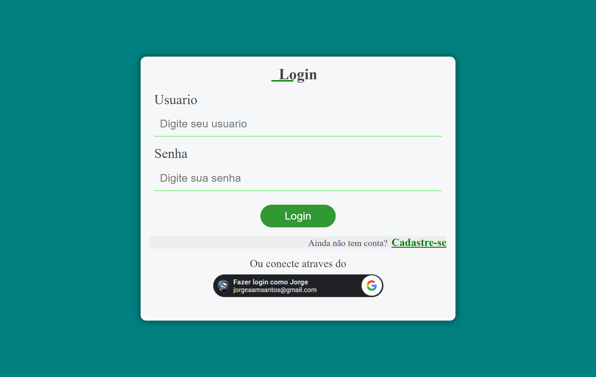
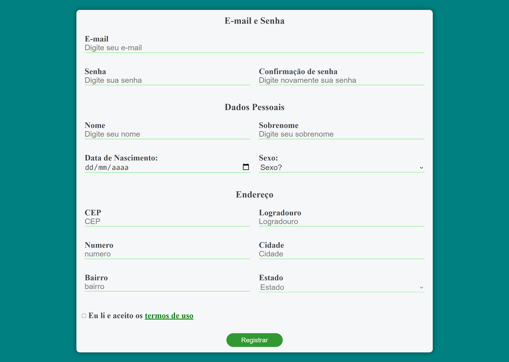
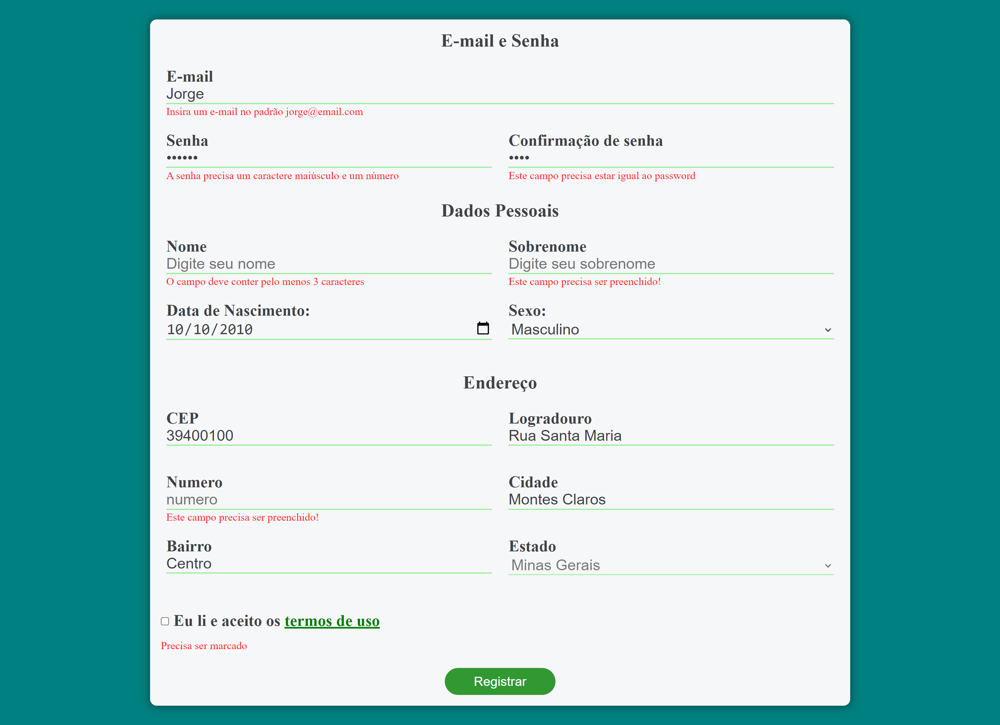

<h1> Login e Cadastro por Formulário📌📋📍 </h1>

Deseja conferir como ficou o resultado do projeto? Teste a funcionalidade através deste Link: [Clique Aqui](https://jorgedeaquino.github.io/Cadastro-Form/).

## **Demonstração Desktop💻⌨🖱**

 
 

<h2>Sobre o Projeto:</h2>
  
  O projeto apresenta área de login que pode ser feita diretamente com o aplicativo, a possibilidade de login com o Google via API (para testar essa funcionalidade leia as considerações), o cadastre-se direciona para a página de cadastro através de um formulário com validações e também consumo da API VIACEP que facilita com o preenchimento automatico do endereço.
  
  
  Foi utilizado a biblioteca JWT (JSON Web Token), que permite a autenticação entre duas partes por meio de um token para uma requisição autenticada.
  
  
  Vale ressaltar ainda a responsividade da aplicação.

<h2>Tecnologias utilizadas:</h2>

        
        JavaScript

	
  
	

        
        HTML

  
	

        
        CSS

	
  
	

        
        Git

  

 * API Login com o Google 

  

 * API ViaCEP 
	
  

 * biblioteca JWT
	
  
  
  

 
  <h2> Contatos:</h2>
   
  

<h3> Considerações <h3>

  * Importante:   Para testar a funcionalidade de login com o google após baixar o arquivo é necessário introduzir o ID do google (por se tratar de uma informação pessoal foi retirado do código), qualquer dúvida estou à disposição.   
* Local a ser inserido o ID, na pasta “JS”, arquivo “main.js”, na linha 18 = (client_id: "",) 

